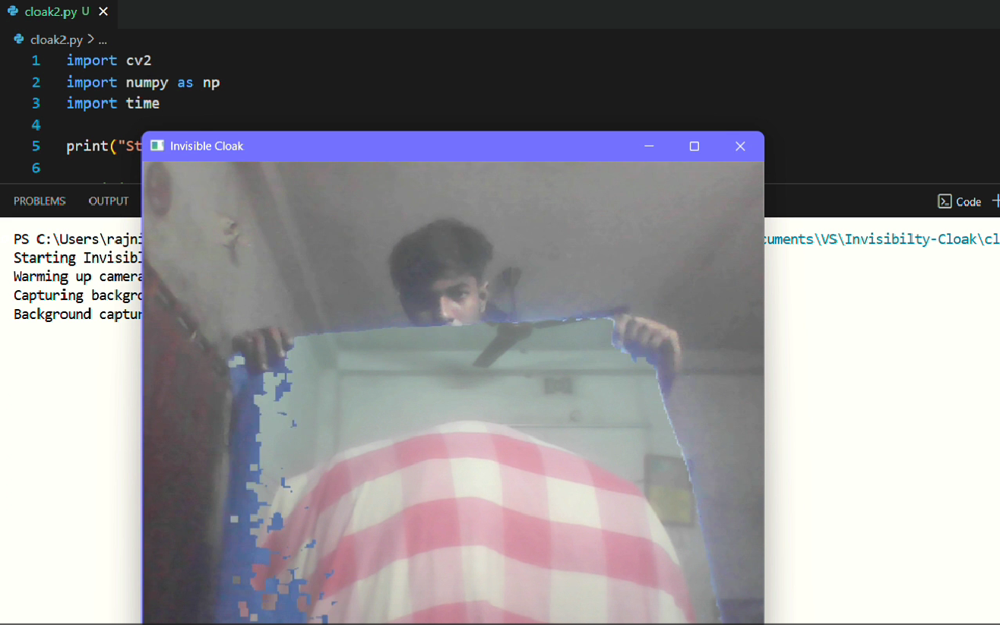

# 🧙‍♂️ Harry Potter Invisibility Cloak 

This mini-project recreates the **Harry Potter–style Invisible Cloak** effect using **OpenCV** and **NumPy** in Python.  
By detecting a specific color (blue here) from the webcam and replacing that color with the background, it creates an *illusion of invisibility* in real time.  

---

###  🎬 Demo Video

https://github.com/user-attachments/assets/763119a0-a2e7-486e-9fe8-4629c1aa896f 

###  🖼 Image

  

## 🧠 How It Works

1. The camera first captures the **background** (without the person).  
2. When the person enters the frame wearing a **specific color cloak** (default: blue), the program detects that color using the **HSV color space**.  
3. That colored region is replaced with the **previously captured background**, making the cloak area appear *invisible*.  
4. The result is shown live using **OpenCV’s video window**.

---

## ⚙️ Requirements

- Python 
- OpenCV
- Numpy
- A working webcam

